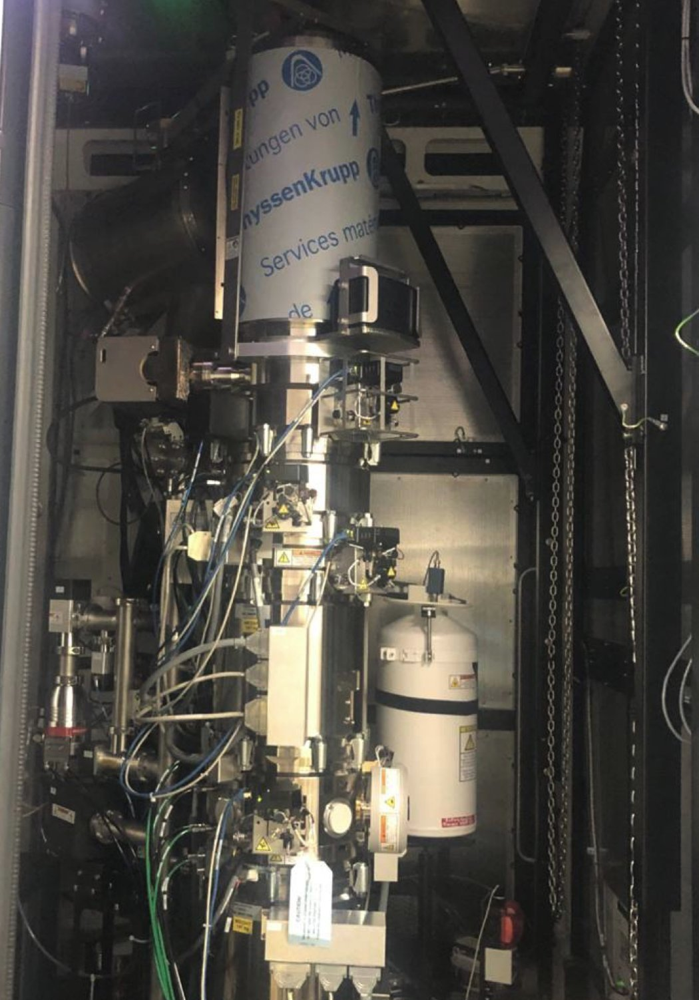
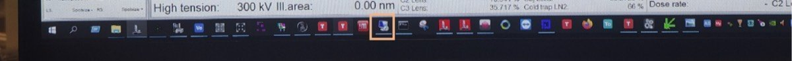
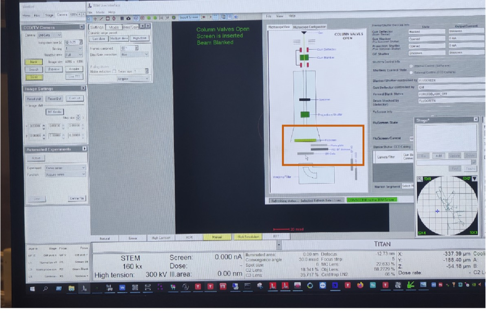
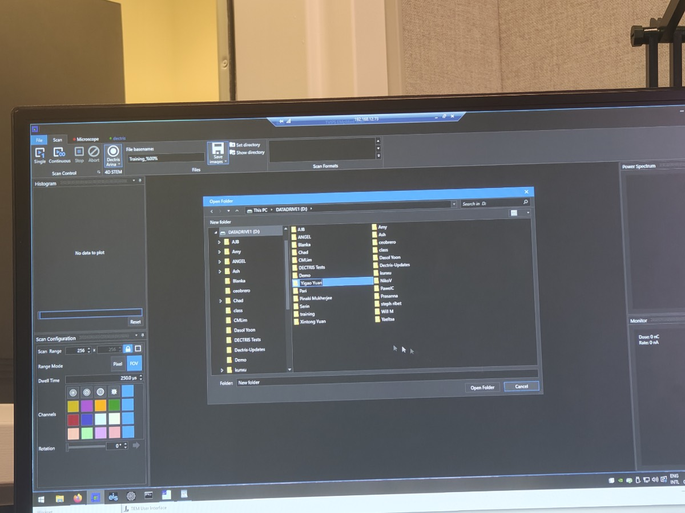
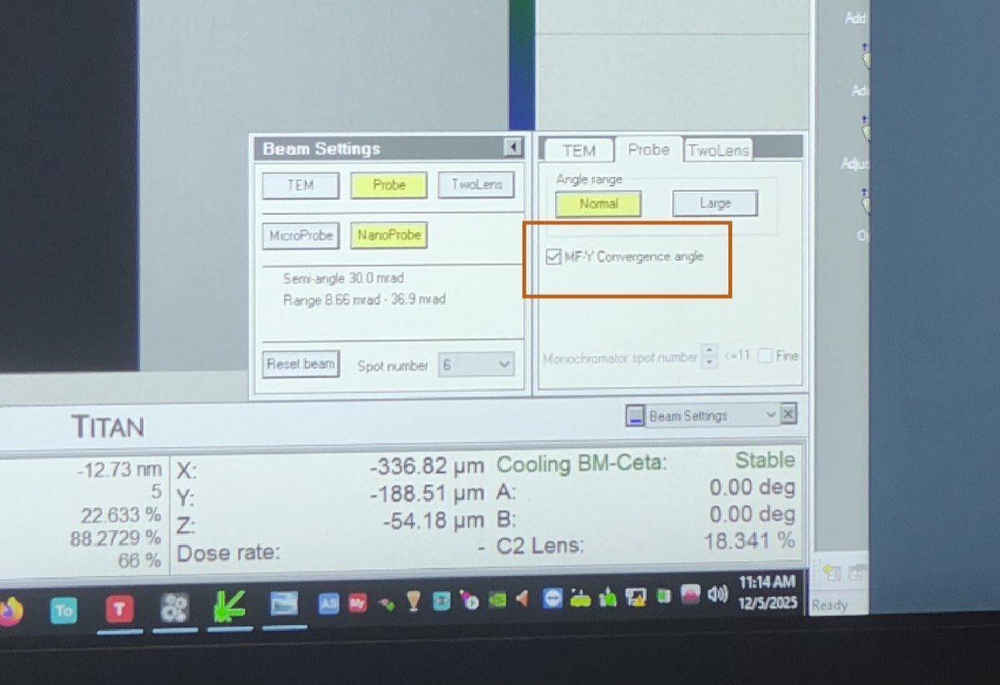
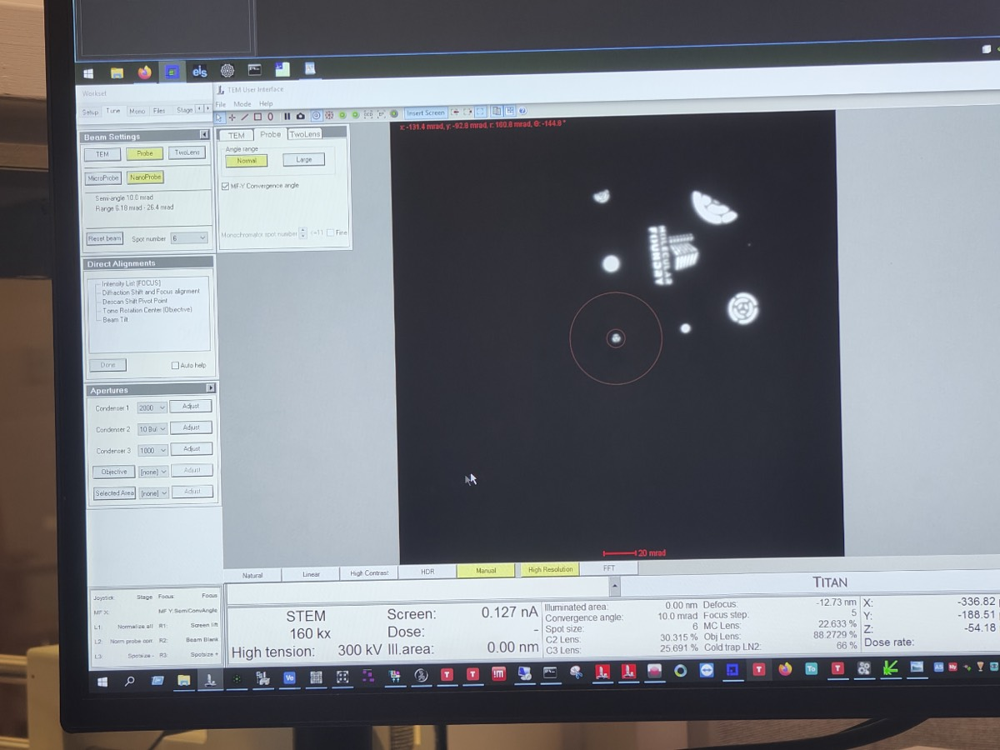
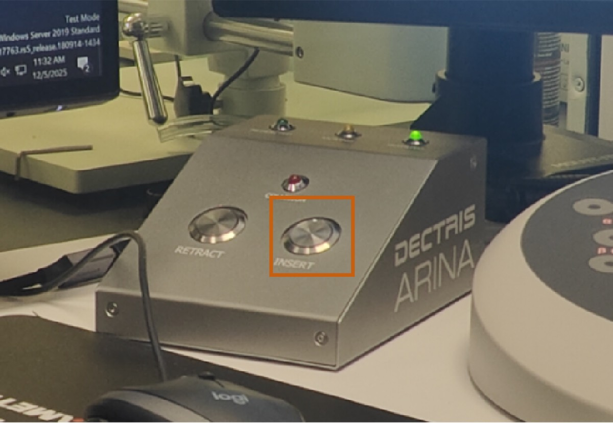
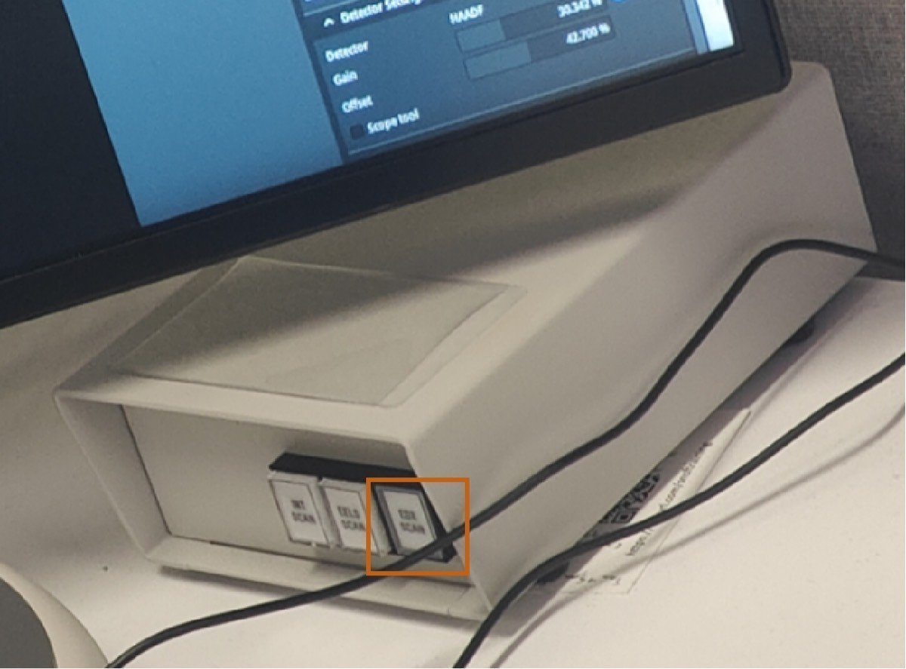
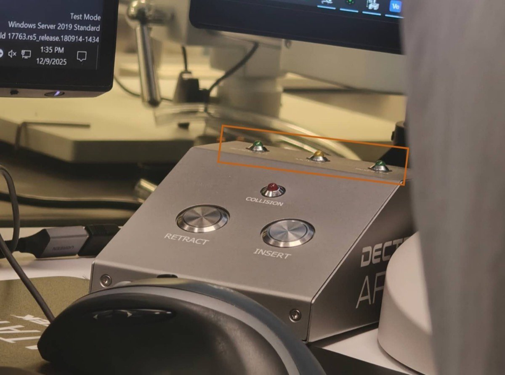

# 4D-STEM

This guide covers the setup and operation of 4D-STEM data acquisition using the Arina detector.

Here is the Dectris Arina hardware within Spectra.

## Part 1: Detector setup

1. **Initialize detector**

   -  Open the instrument box
      -  FIXME: attach image of opening the instrument box

      

   -  Spot the Arina detector

      

   - Press the button below the Arina detector (with blue light) for 10 seconds

2. **Remote computer connect**

   - Click remote connection icon

     
   
   - Enter `192.168.12.73`

3. **Software in remote computer**

   - Open the Firefox browser
   - CETA detector needs to be out. 
   - FIXME: Better resolutiion image
   - Click on the CETA icon to remove CETA

     

4. **How to save file**

   - Open NOVENA detector software
   - Click on `Save Images` and choose folder
      
   - Click on `Continuous` to streamline image
   - Click on `Single` to record and save
   - Note: `(name)_%00%` cannot be deleted, otherwise the file cannot be saved correctly.

## Part 2: Beam configuration

1. **Go to STEM (FIXME)**

   - Click on `Descan`

2. **Beam setting**

   - Go to `Beam Setting`, click on `MF-Y Convergence Angle`
   - This is used for tuning the convergence angle of the beam.

     

3. **Adjust aperture and convergence angle (FIXME: refined this step)**

   - C2 aperture: Change from 70 → 50
   - Convergence angle: Use Multifunction Y to adjust to 10 mrad (1/5 relationship with C2. If C2 is 70, convergence angle should be 14 mrad.)
   - Click on `MF-Y Convergence Angle` to close

     

   - Remove other apertures
   - C3 aperture: Change from 1000 → 30 (you can use C2 at 50 to check if C3 is centered)
   - Adjust current: Go to `Mono`, click on `Focus`, use the Intensity knob to adjust the current to ~0.032 nA

4. **Camera length**

   - Set camera length to 230 mm or 285 mm, depending on your needs

5. **Retract HAADF**

   - Click on `HAADF` to take the HAADF detector out

## Part 3: Acquisition

1. **Insert detector**

    - Press the `Insert` button to insert the Detris Arina detector

      

    - Press `EDS Scan` to see things (from `INT Scan`)

      

    - Press the `R1` button so lift the flu screen

2. **Acquisition**

    - Click `Scan` → `Continuous` to check
    - Center the main spot
    - If it is OK, click on `Stop`, then click on `Single Scan` to obtain data

3. **Analysis software (EIS)**

    - Click on `Rebin`, `Reprocess` – you can use the software to do a simple analysis

## Part 4: End session

4. **Finish**

    - Retract the detector: Press `Retract` on the Detectris Arina handl panel
      
    - Open the micfroscope Spectra box
    - Arina detector and press the button located under the the detector. (with blue light) for 10 seconds. It will close and the light will turn off.

## FAQs

- **50 µm C2 aperture:** Provides better coherence and a more defined probe for clean diffraction patterns at each probe position.

- **10 mrad convergence angle:** Determines probe focus and diffraction disk size. Balances probe size with disk separation in the CBED pattern.

- **230 mm camera length:** Positions the diffraction pattern appropriately on the detector, ensuring Bragg disks fall within the detector area.

## Changelog

- Dec 10, 2025 - First draft and images shared by Guoliang Hu
