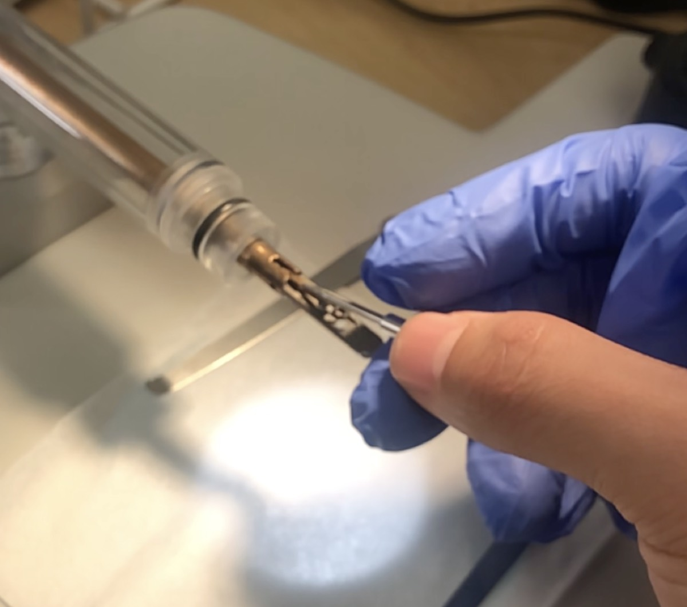
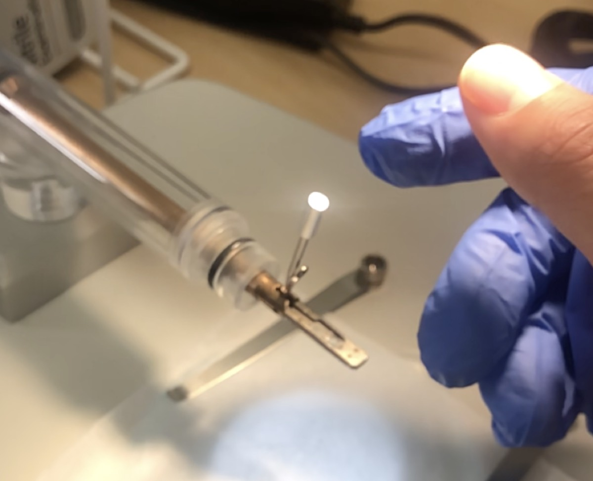
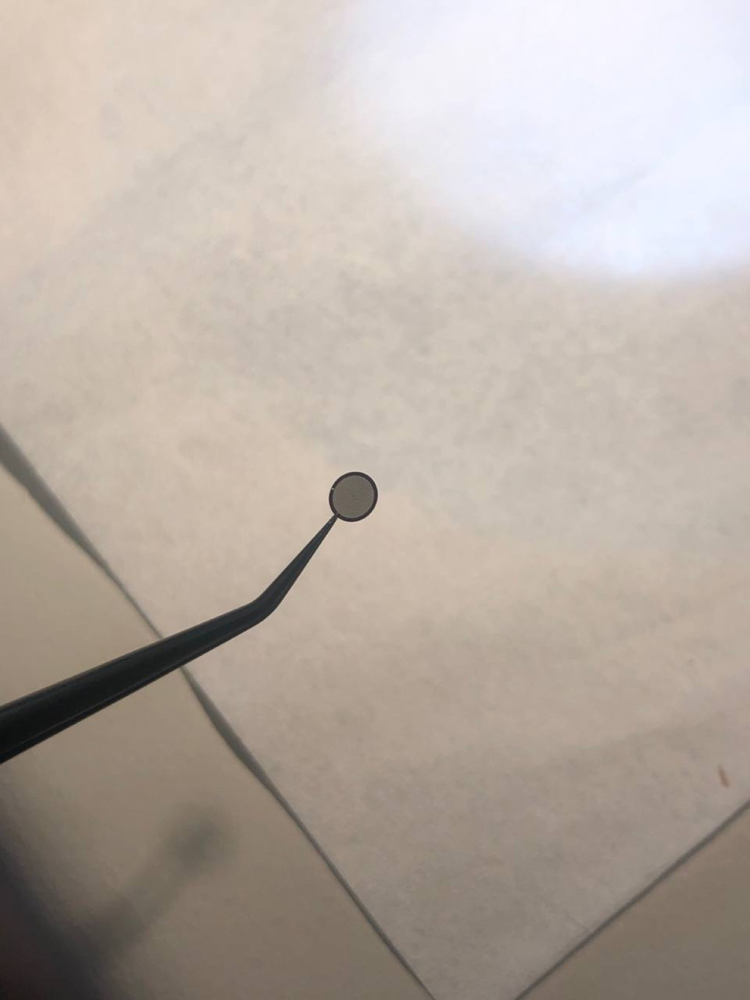
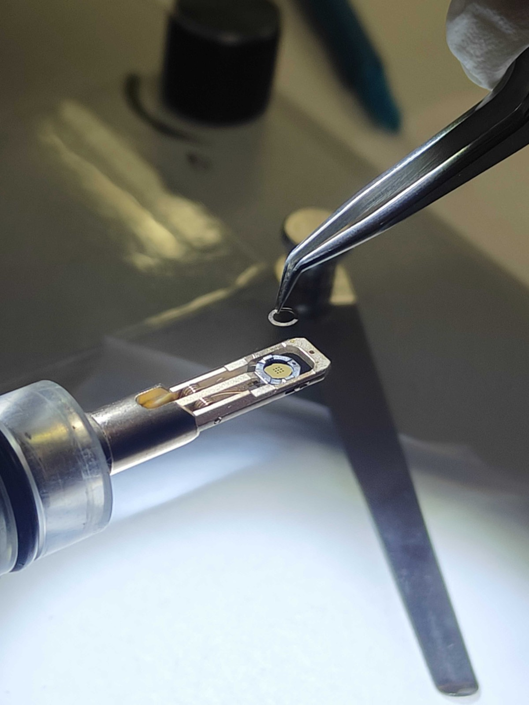
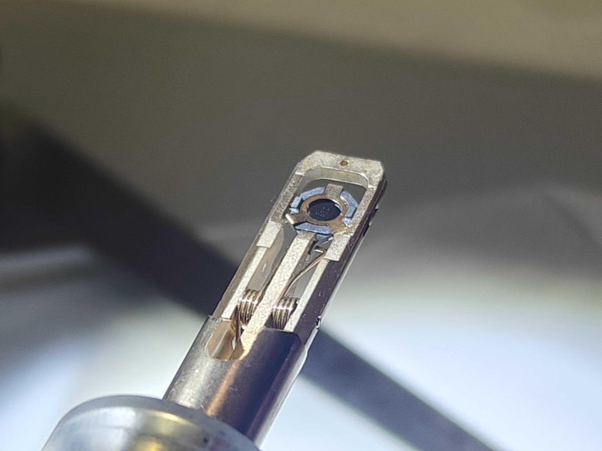
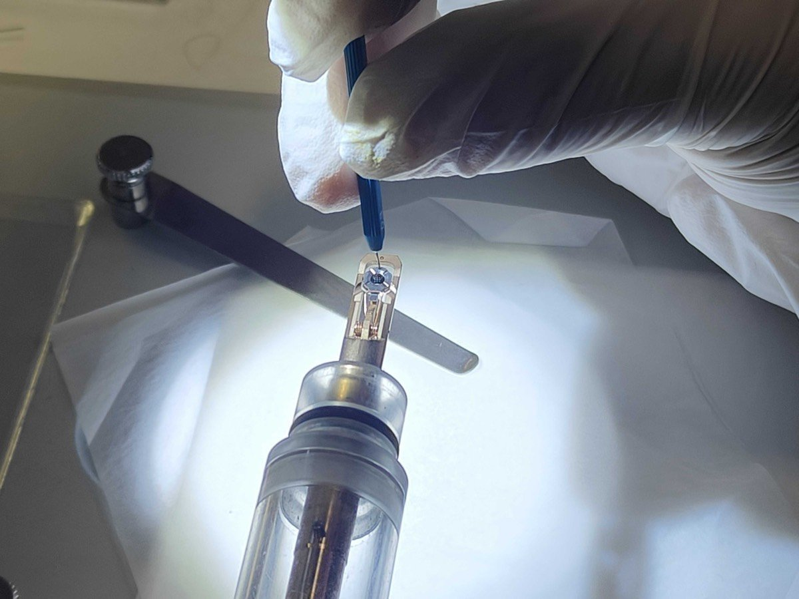
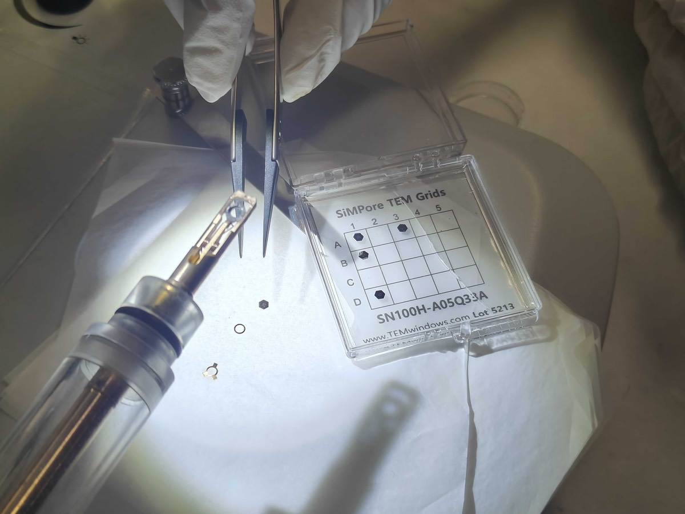
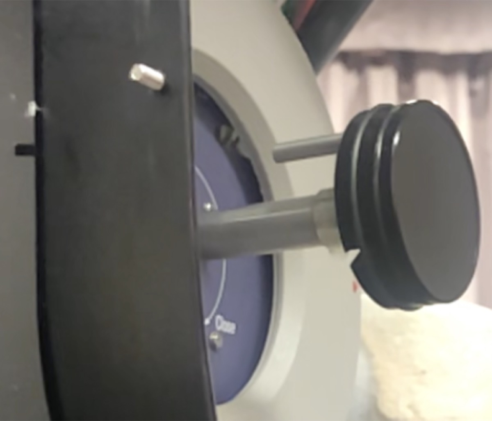

# Electron Microscopy Training (WIP)

The content is meant to be used as a step-by-step tutorial focused on practice
sitting in front of the microscope with a focus on visual elements.

Disclaimer: Always follow https://barnum.su.domains/ for correctness. Only use
this documentation if you are working with the authors of the document and you
are looking for quick visual references.

## Available guides

| Guide                           | Description                               | Status         |
| ------------------------------- | ----------------------------------------- | -------------- |
| [STEM](STEM.md)                 | Basic STEM alignment procedures           | Available      |
| [4D-STEM](4D-STEM.md)           | 4D-STEM acquisition with Dectris detector | Available      |
| [EELS](EELS.md)                 | Electron Energy Loss Spectroscopy         | 🚧 Coming soon |
| [EDS](EDS.md)                   | Energy Dispersive X-ray Spectroscopy      | 🚧 Coming soon |
| [Tomography](tomography.md)     | Electron tomography                       | 🚧 Coming soon |
| [Ptychography](ptychography.md) | Ptychography imaging                      | 🚧 Coming soon |
| PES                             | -                                         | 🚧 Coming soon |

## How to load sample

> Disclaimer: This guide is written for those who have already used single-tilt
> and double-tilt before. If you are using this documentation for the first
> time, you should work with a supervisor.

### Single-tilt holder

**Load sample:**





**Holder ready:**




### Double-tilt holder

**Load sample:**

1. Load the sample and washer (gold donut):



2. Add the cap and rotate the holder about the long axis to ensure the sample is
   secure:



**Upload sample**





## How to remove and insert holder

**Insert holder**

- Push the holder in, feel resistance. This will start the turbo pump immediately.
- Wait 2 minutes, turn counter-clockwise.
- Guide the holder to push in.
- On TEMUI, turn off turbo pump.



**Remove holder**

- Reset holder in TEMUI.
- Close column valves in TEMUI.
- Pull the holder straight out, turn clockwise, pull the rest out continuously.

## For maintainers and authors

### Checklist for the human

- [ ] Is our writing the most clear, yet concise for making decision?
- [ ] Added concise changelog for each document? Ex) `Dec 13, 2025 - add 4D-STEM tutorial draft by @bobleesj`
- [ ] New images added? Did you run `python scripts/compress_images.py img/`

### Writing conventions

For consistency, use the following style (feed to LLM)

- Use `##` for main sections, `###` for numbered steps
- Use sub-bullets (`-`) for details under each step
- Use `<details>` and `<summary>` for collapsible FAQs
- Place images after relevant steps with `alt` text and `width="500"`
- Use `.jpg` format for images (not `.png`)
- Do not use horizontal lines (`---`)
- Keep TODO items at the top of each document (e.g., `> TODO: ...`)
- Keep a `## Changelog` section at the bottom with dated entries

### Scripts

#### Image compression

Compress JPG images without losing quality:

```bash
# Install dependencies
pip install Pillow

# Compress all images in a folder
python scripts/compress_images.py img/

# Preview changes without modifying files
python scripts/compress_images.py img/ --dry-run

# Adjust quality (default: 85, lower = smaller file)
python scripts/compress_images.py img/ --quality 70

# Resize large images to max width
python scripts/compress_images.py img/ --max-width 1200
```
