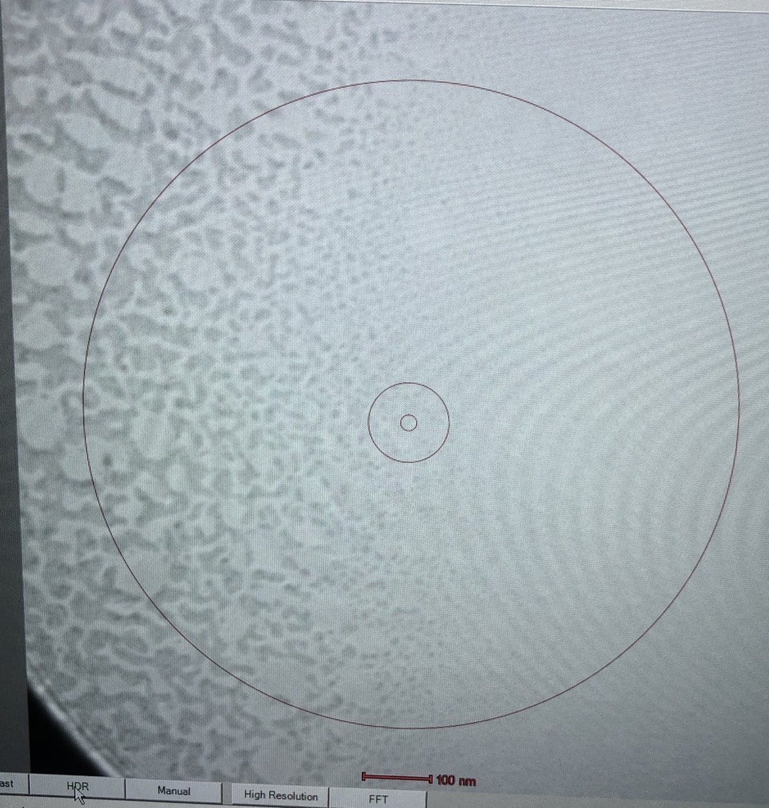
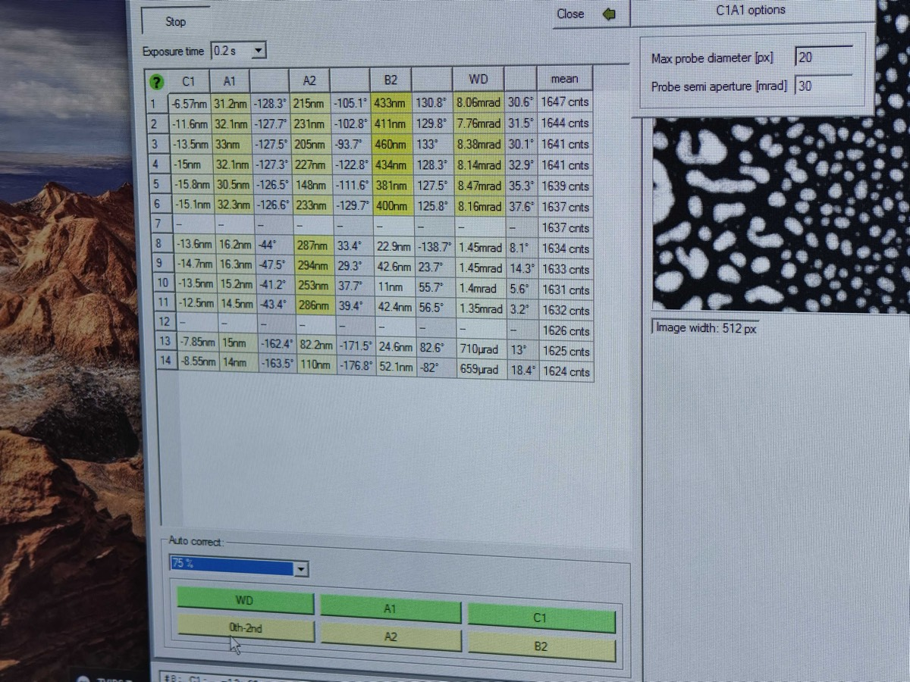
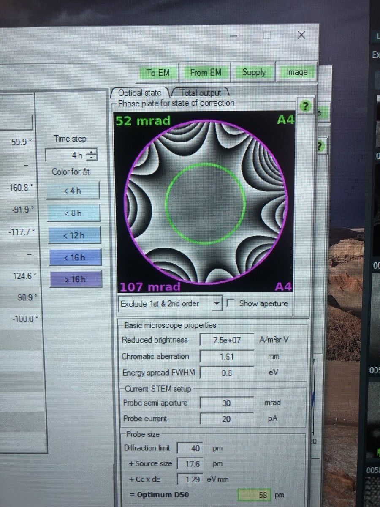
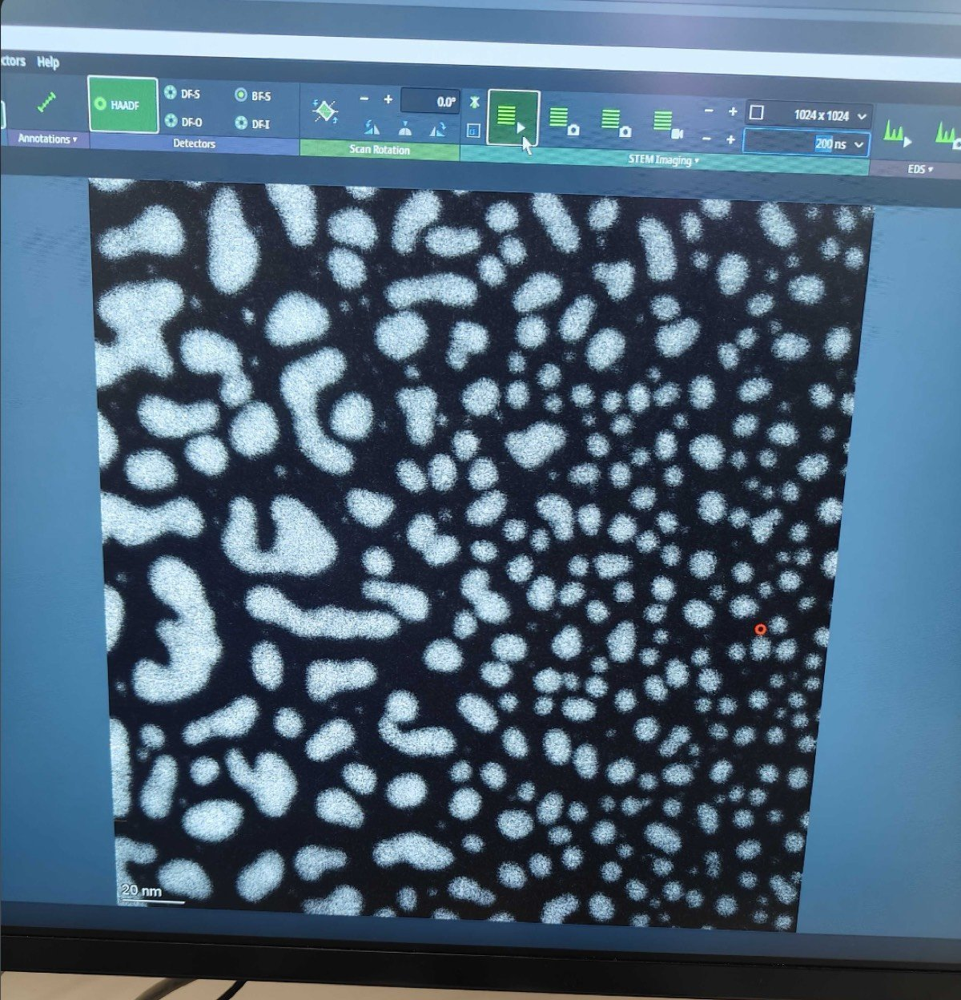
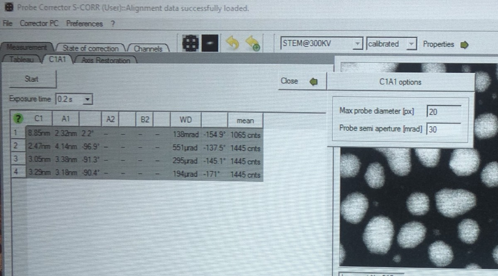
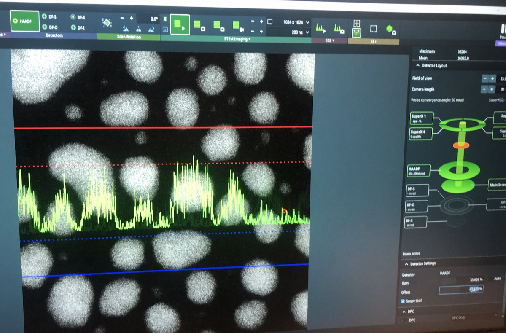
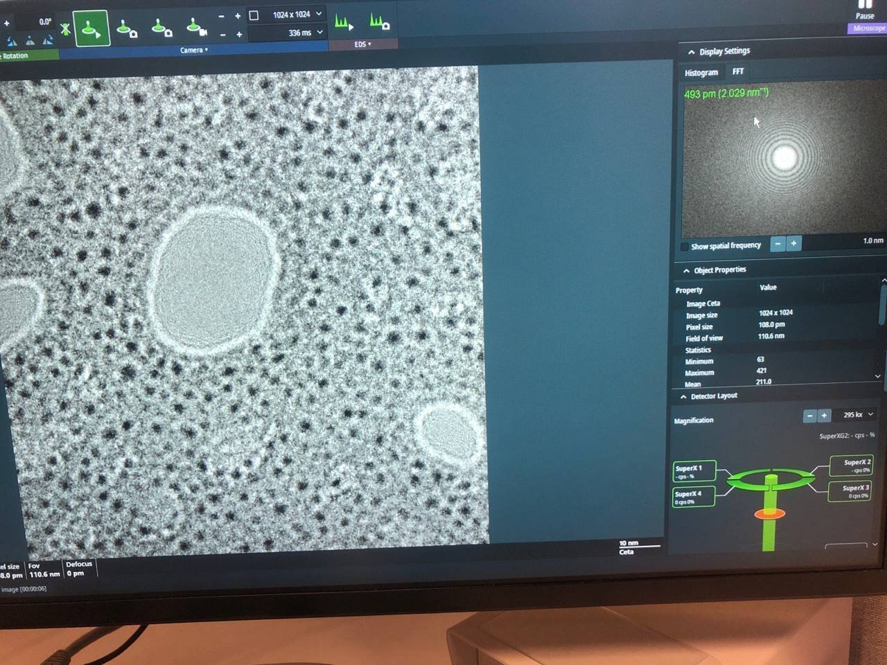

# STEM

> TODO: Add image for mono
> TODO: focus

The process is divided into three parts. TEM alignment sets up the "highway"
(column optics), STEM alignment fine-tunes the "car" (focused probe), and then
you're ready to image your sample.

1. **Part 1: Alignment with TEM** — column optics
2. **Part 2: Alignment with STEM** — focused probe
3. **Part 3: Alignment with your sample** — actual imaging

> **Prerequisite:** Complete the [Sample loading](README.md#sample-loading)
> procedure before starting alignment.

## Part 1: Column optics alignment in TEM mode

Turn the turbo pump off if you are working with a standard sample. Go to TEM
mode in Velox.

### 1. Find beam

- Click `Col Valves Open` on TEMUI.
- On TEMUI, ensure C1 is 2000, C2 is 70, and C3 is 1,000 µm.
- At 700x, drive around to locate the interaction between gold (dark) and carbon
  areas.

- Increase magnification to ~7,500x.

### 2. Adjust eucentric height

Find the z-position of the sample where tilting does NOT drift the sample.

- On TEMUI, choose the linear or HDR mode to image. No beam found? Use lower
  magnification.
- Turn intensity knob to see the diffraction pattern.
- (Preferred way on Spectra) On the hand-panel, press z-axis to converge the
  beam until the diffraction pattern disappears.
- At eucentric height, notice minimal contrast in the image (no strong
  dark/white changes).

### 3. Direct alignment

Here, we align the Condenser lens 2 aperture and the beam. In STEM, C1, C2, C3 lenses are used. We temporarily switch to C1/C2 (two-lens) mode. The C2 aperture determines
the overall beam size.

**Center C2 aperture along optical axis:**

- On TEMUI bottom right, click the dropdown → "Beam Setting" → "Tune" tab → "Two
  lens" (C3 is disabled).
- Click on `Adjust` of C2 to center the beam.
- Adjust intensity knob to make it small.
- Click on `TEM` to go back to three-lens mode.

**Fix monochromator:**

- Do you see a jagged area? If no, skip this step.
- Set magnification to around ~5700x.
- On TEMUI, go to "Mono" tab and use "Shift" with the multifunction knobs to
  move the jagged area.

**Fix condenser stigmation:**

- Make beam on fluorescent screen, baseball size.
- It not concentric with intensity knobs varied, click on `Stigmator → Condenser`
- Adjust multifunction knobs.
- There may not be a perfect circle due to contamination and diffraction pattern
  interference.

**Fix beam tilt:**

- Click `Beam tilt pp X/y` and Y, under `Direct Alignment`.
- Find the minimum jiggle by moving multifunction knobs.

**Fix rotation center:**

- Increase beam all the way to the fluorescent screen and see the image formed.
- Find "sharp refined features" (if needed, go to lower magnification to find
  it).
- Click "Rotation center" under Direct Alignments.

- Notice the image pulsing in and out of page (go to higher magnification to see
  it clearly).
- Use multifunction X/Y to adjust if needed.

### 4. Image sample

- Go to a flat area where there are no holes. TEM distribution of particle size
  matters, but in STEM it isn't that critical.
- Under "Image Corrector" software, click "Reset" for Objective, Diffraction,
  and Image C1A1.
- Press C1A1 — aim for A1 < 5 nm, A2/B2 < 5 µm.
- Press `R2` to lift the fluorescent screen.
- Use `A1Course`, optionally go to Fast Tableaus, start with 15 mrad.
- In TEMUI, go to `Files` → `SBL FEG Registers` to save the alignment setup.

**Running C1A1 in Velox:**

- Turn on Velox, press R2, take a picture, and run in Image Corrector.
- Before you click, make sure beam intensity is correct (~10 A/s).
- Max count is 8,000! Adjust the exposure time accordingly.
- "Reduce Noise" doubles time, so uncheck it.

> Once tuned, don't touch the hand panel.

You want about 5 rings in the gold sample—underfocus shows too many rings. After
C1A1, aim for A1 < 5 nm, A2/B2 < 5 µm, then go to "Tableau" tab → "Fast".

## Part 2: Probe alignment in STEM mode

Go to `STEM` mode in Velox.

### 5. STEM mode

> No trackball.

- On Velox, click on `STEM`, `HAADF`, use 1024×1024 / 250 ns dwell time.
- Focus worsens. Eucentric height is slightly modified.
- Modify z-axis to get the sharpest features.
- Center beam with respect to HAADF detector region using the Direct Alignment
  tab in TEMUI.
- On Velox, set convergence angle of 30 mrad, camera length 91 mm, 100 pA (0.097 nA).
- Too high pA? Adjust the monochromator.

### 6. Correct probe

- Find an area with a distribution of particle sizes. Magnification ~225 kx.
- TEMUI → "STEM autotuning" quick access → Settings → Reset. This resets
  aberration 1st and 2nd order.
- In Probe Corrector software, ensure probe diameter 20 nm and probe
  semi-aperture 30 mrad is set.
- Go to C1A1 → Options → Check probe diameter and semi-aperture settings.
- Run C1A1 in Probe Corrector software.
- In Velox, stop recording → 75%, 0th–2nd order.
- Press A1C.
- Press "Start" — aim for A1 < 5 nm, A2/B2 < 100 nm, A3/C3/S6 < 5 µm.
  - We don't want yellow indicators.
- Go to Tableau → "Standard" → "Start", then adjust C2/S2 based on the image
  until you see A4.
  > When C1A1 becomes "grey," go to Velox → Scope Tool and repeat the correction
  > process.

## Part 3: Use your own sample

> How to find convergence angle? Go to Beam Setting → Probe. Use MF-Y to adjust
> convergence angle.

### Find zone-axis

- Under "Quick" tab, press "Sample Piezo" and fine-tune z-axis.
- Unblank the beam.
- On Velox, move the probe position around by dragging the red dot.
- Under "Quick" tab, "Smart Tilt" moves alpha and beta axes automatically.
- Adjust alpha tilt and beta tilt using the controls on the left.

In Velox → HAADF, pause, unblank the beam.

> As long as you see C3, you are fine.

After tilting, come back to C1A1 and make sure it's all good. Then close the
column and turn the turbo pump on.

## Appendix

"gray" colors during correction, go to Velox `Auto-tune`****.

Underfocus or overfocus?

Underfocus → features appear with dark cores and bright Fresnel fringes on their edges.

Overfocus → the contrast inverts: bright cores with dark edge fringes.

## FAQs

What do Tableau and C1A1 do in STEM?

Tableau provides a quick visual assessment of aberrations. C1A1 is the first-order aberration correction routine that corrects for astigmatism and coma.

Why zoom or probe correct in small nanoparticles area?

Focus on where "size gradient" begins — between dark film and "bulk." Better for aberration algorithms.

What is a monochromator?

A monochromator filters the electron beam to select a narrow energy range, improving energy resolution for spectroscopy (EELS).

Which direction is underfocus in the handpanel?

Counterclockwise, down in Z-axis.

How to tell underfocus, in-focus, overfocus?

Underfocus: edges become white.

What is eucentric focus?

Defocus = 0, it's stable and fixed.

Why scan often instead of just acquiring data?

Tilt causes FOV to change.

Why still wobble microscopy at x.x Mx?

To ensure no sample-induced aberration.

How to verify zone axis?

Use CrystalMaker simulated diffraction and Kikuchi lines crossing in the center.

How do you tell major zone axis?

Thick bends tend to form.

## Lens system

Why do we need the objective lens in TEM and STEM?

In STEM, the objective lens sits above the sample and focuses the electron probe to a tiny spot (~1 Å). In TEM, the objective lens sits below the sample and forms the first magnified image.

What is the relationship between objective lens, back focal plane, and image plane in TEM?

After electrons pass through the sample, they scatter at various angles. The objective lens focuses electrons scattered at the same angle to the same point on the back focal plane (forming the diffraction pattern). The electrons then continue and refocus at the image plane, where electrons from the same sample location meet (forming the image).

What is spherical aberration (Cs) and why does it matter?

Spherical aberration causes electrons passing through the outer part of the lens to focus at a different point than those through the center. This blurs the image and limits resolution. That's why we need Cs correctors.

What is chromatic aberration (Cc)?

Electrons with different energies get focused at different points. This causes blur. A monochromator reduces Cc by filtering the beam to a narrow energy range.

Why do we need a Cs corrector (probe corrector)?

The Cs corrector uses multipole lenses to cancel out spherical aberration, allowing sub-angstrom resolution. Without it, resolution is limited to ~1-2 Å.

Why are there three condenser lenses (C1, C2, C3) in STEM?

C1 controls brightness (demagnifies the source), C2 controls beam size/convergence, and C3 provides additional flexibility for probe formation. Together they give fine control over the probe.

Why does the beam converge when turning the intensity knob?

The intensity knob adjusts the C2 lens to move the crossover point. Turning it clockwise moves the crossover closer to the sample/screen plane → beam is more focused → smaller, brighter spot (higher intensity per area). Turning counterclockwise moves crossover away → beam spreads out → larger, dimmer spot. "Intensity" refers to brightness per unit area, not total electrons.

What is the C2 aperture and why do we align it?

The C2 aperture limits the beam angle and blocks stray electrons. Aligning it ensures the beam is centered on the optical axis, which is critical for good imaging.

What is crossover and why does it need to be symmetric?

Crossover is where the beam comes to a focus point. If it's not symmetric (elliptical), there's astigmatism in the condenser system, which degrades the probe shape.

What's the difference between two-lens and three-lens mode?

Two-lens mode (C1+C2) is the traditional TEM setup — sufficient for parallel illumination. Three-lens mode (C1+C2+C3) is used in STEM for finer control of the probe. During alignment, we temporarily switch to two-lens mode because it's simpler to align the C2 aperture when C3 is disabled.

What is the objective aperture and what does it do?

The objective aperture sits at the back focal plane and selects which diffracted beams contribute to the image. Smaller aperture = more contrast but less resolution.

What are the projector lenses for?

Projector lenses magnify and project either the image plane (for imaging) or back focal plane (for diffraction) onto the screen/camera.

Why does focus change when you change magnification?

Different magnifications use different lens settings, which slightly shifts the focal plane. You need to refocus after changing mag.

What is astigmatism and how do you correct it?

Astigmatism makes the beam/image elliptical instead of round due to lens imperfections. Correct it using stigmator coils (X and Y) to make the beam circular.

What is the relationship between convergence angle and resolution?

Larger convergence angle = higher resolution (smaller probe) but also more aberrations. There's an optimal angle where resolution is best.

## STEM detectors

What detectors are used in STEM?

HAADF (High-Angle Annular Dark Field): collects high-angle scattered electrons, gives Z-contrast. ABF (Annular Bright Field): collects low-angle, good for light elements. BF (Bright Field): collects direct beam.

Why is HAADF called "Z-contrast"?

Scattering intensity scales roughly with Z² (atomic number squared). Heavier atoms scatter more → appear brighter. This makes it easy to distinguish heavy from light elements.

What is a ronchigram?

A ronchigram is the shadow image of the probe on the detector when focused on an amorphous area. It's used to measure and correct aberrations — a flat, featureless ronchigram means good alignment.

## Beam sensitive samples

How to deal with beam sensitive region? (Dec 8, 2025)

Still scan, but on a small window only, so it doesn't damage other areas.

What is the intensity of beam for beam sensitive materials?

~50 pA can cause beam damage.

Any other way?

Use lower keV, but that may require many hours for the beam to stabilize, for a
few hours.

## References

- [Thermo Fisher Spectra 300 TEM](https://www.thermofisher.com/us/en/home/#electron-microscopy/products/transmission-electron-microscopes/spectra-300-tem.html)

## Changelog

- Dec 8, 2025 - First draft of SNSF Spectra training by @bobleesj
