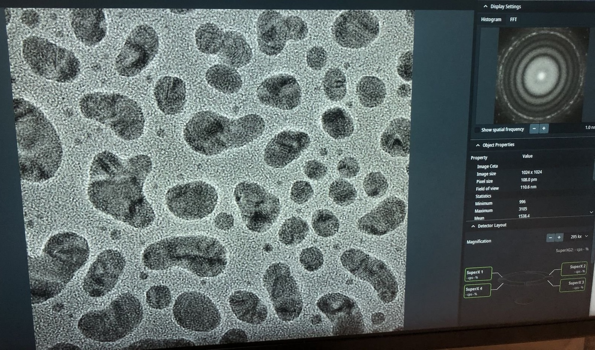

# STEM

This guide covers STEM alignment on the Spectra 300. The process has three parts: TEM alignment (column optics), STEM alignment (focused probe), and imaging your sample.

> **Prerequisite:** Complete the [sample loading](sample-loading.md) procedure before starting.

> FIXME: when do we want to save sample position when we load our own sample?
> FIXME: tips on finding zone axis?

**Acronyms:**

- `mulXY` - Multifunction X/Y knobs on hand panel
- `TEMUI` - TEM User Interface (software)

## Part 0: Check

> [!CAUTION]
> 1. Ensure Standard Sample is loaded

## Part 1: Column optics alignment in TEM

1. **Find beam**

   - Ensure column valve is closed and turbo pump is on.
   - Verify `Col Valves Closed` and `Turbo On` are shown:

     

   - Set 2000, 70, 1000 for Condenser 1, 2, 3: Under `Tune` tab → `Apertures`

     

   - Set ~500x magnification by adjusting magnification knob
   - Locate the gold (dark) and amorphous carbon boundary by driving joystick on hand panel

     

2. **Adjust eucentric height**

   - Set ~7,500x mag by adjusting magnification knob
     

   - Press `Eucentric Focus` on hand panel

   - Notice diffraction pattern. Roll mouse scroller to see greater contrast.

     

   - Converge the beam to a tiny dot with intensity knob. Press `Z-axis` up or down until no diffraction pattern is visible.

     
     

   - Increase intensity. Notice image shows approximately minimal contrast between gold and amorphous carbon region.

     

   - Press `z-axis` up or down on hand panel to reduce contrast even further

     

3. **Align monochromator** 

   - Jagged area visible like above image? Skip this section. Otherwise, continue.
   - `Mono` tab → `Monochromator Tune (Expert)`, click `Shift`

     

   - Adjust `mulXY` knob until the jagged area disappears.

4. **Align C2 aperture**

   - Enter `TwoLens` mode. `Tune` tab → `Beam Settings`, click `Twolens`

     

   - Notice beam shifted away from center.
   - Converge beam by varying intensity knob
   - Center beam by rolling hand panel ball
   - Vary beam size by turning intensity knob counterclockwise and clockwise. Notice beam size is not concentric.
   - Make concentric beam: `Apertures` → click `Adjust` next to `Condenser 2`, adjust `mulXY` knob
     

   - Go back to three-lens mode: `Beam Settings` tab → click `TEM`  
     > FIXME: add screenshot
   - Ensure beam is centered and concentric. Example:

     

5. **Fix condenser lens stigmatism**

   - Set ~200kx magnification by adjusting magnification knob
   - Beam shifted from center? `Tune` tab → `Direct Alignment`, click `Beam Shift`, adjust `mulXY` knobs
   - Enlarge the beam by adjusting intensity knob

     

   - Still not concentric? `Stigmator` → `Condenser`, adjust `mulXY` knobs

6. **Fix beam tilt**

   - Under `Direct Alignment`, click `Beam tilt pp X`, adjust `mulXY` knob to minimize jiggle
   - Repeat for `Beam tilt pp Y`
   - Beam center shifted again? Click `Beam Shift`, adjust `mulXY` knobs

7. **Fix rotation center**

   - Under `Direct Alignment`, click `Rotation Center`
   - Notice the image is pulsing in and out of the screen.
   - Adjust `mulXY` knobs to minimize lateral movement, parallel to the screen

8. **Capture image**

   - Find a flat area with a distribution of particle sizes and no holes
   - Press `R1` to lift fluorescent screen. This enables the beam to be detected by the detector.
   - In `Velox`, click the play button to start seeing the image

     

   - (Optional) Press `z-axis` buttons to see how focus can change image:

     Under focus:

     

     On focus:

     

     Over focus:

     

9.  **Run image corrector**

   - Press `Z-axis` down until you see 4-5 rings in FFT (slight underfocus)

     

   - Stop recording. In `Velox`, click play button again
   - Reset `Objective`, `Image A1` in `TEMUI/Stigmator`. Right-click each button to reset

     

   - Open `ImageCorrector` software
   - Click `C1A1` tab → `Start`
   - Aim for A1 < 5 nm. If `C1` shows orange, manually adjust Z-axis during iteration
   - Set intensity to 800-900 counts by adjusting Intensity knob
   - `C1` should be close to the suggested number. Below, software suggests C1 ~-599.3 nm.

     

   - Go to `Tableau` tab → choose `Standard` under `Tableau type` → click `Start`

     

   - Click `Accept` after the iteration
   - Go to `Tableau` → `Fast`
   - Click `Accept`
   - Press the A1, C1, etc. buttons in order
   - Check values meet the table below

   **Target values (TEM Image Corrector):**

   | Parameter | Resolution < 0.10 nm (20 mrad) | Resolution < 0.08 nm (24 mrad) |
   |-----------|-------------------------------|--------------------------------|
   | A1        | < 5 nm                        | < 5 nm                         |
   | A2        | < 100 nm                      | < 50 nm                        |
   | B2        | < 100 nm                      | < 50 nm                        |
   | C3        | ~ -8 μm                       | ~ -8 μm                        |
   | A3        | < 5 μm                        | < 1.5 μm                       |
   | S3        | < 5 μm                        | < 1 μm                         |

   - In `Velox`, click on the `Camera` button to take the picture

10. **Save optics settings**

    - `TEMUI` → `Files` → `SBL FEG Registers`
    - Add name `300KV-TEM-<NAME>` and click `Add`

      

    - Done! You are now ready for STEM probe alignment next.
    
## Part 2: Probe alignment in STEM mode

1. **Switch to STEM**

   - In `Velox`, click `STEM`, `HAADF`, set 1024×1024 / 250 ns dwell time
   - Drive around, set magnification to ~225 kx, find area with good distribution of feature sizes

     

   - Adjust z-axis on hand panel until sharpest features
   - Verify convergence angle of 30 mrad, camera length 91 mm

     

   - Current should be ~0.100 nA. Too low? `Mono` tab →  `Monochromator Tune (Expert)` → `Shift`, click `Focus`, use `Intensity` knob to adjust

      > FIXME: press `Shift` or `Focus`?

     

   - Center beam on HAADF detector by clicking the HAADF button on TEMUI

2. **Reset aberrations**

> Why reset? The probe corrector software (Sherpa) measures the actual probe shape/ronchigram to calculate what corrections are needed. If manual stigmator corrections are already applied, the software can't distinguish between real aberrations from the optics and artificial corrections added.

   - Select `STEM Auto Tuning` in quick dropdown, click `Reset`.

     

   - Select `Stigmator` in quick dropdown, set `Probe A1` and `Condenser` to zero (right click)

     

3. **Fine-tune probe alignment**

   Ensure probe is aligned along the optical axis.

   - Press `Diffraction Mode` on hand panel
   - `Tune` tab, `Direct Alignment`, click `Diffraction Shift and Focus Alignment`, adjust `mulXY` knobs

     

   - Click `Center C2 aperture`, adjust with `mulXY`
     > FIXME: where is `Center C2 aperture`?
   - Press `Diffraction Mode` on hand panel again

4. **Run probe corrector**

   - Open `Probe Corrector` software, `Channels` → `Exported elements`, ensure all zero aberration values 

     
   
   - Set probe diameter 20 nm, semi-aperture 30 mrad

     

   - Run `C1A1`, try to make values close to zero

     

   - Click `0th-2nd`, set `Auto correct` to 50%

     

   - Go to `Tableau` → `Standard` → `Start`
   - Notice the aberration surface image. The aberration value in purple (e.g., C3) is the limiting aberration that needs correction.
   - Press the button with aberration C2, etc. sequentially until you see A4

     

   - Go to `C1A1` tab again
   - Adjust `C1` and `A1` again since adjusting higher-order aberrations may affect these
   - Run `C1A1` to ensure both values below 5 nm
   - Go back to `Tableau` tab
   - Select `A5` under Tableau options and click `Reevaluate`

     
   
   - Start `Tableau`, run `C1A1` again until you satisfy the target values below

   **Target values (STEM Probe Corrector):**

   > More or less identical as TEM

   | Parameter | Resolution < 0.10 nm (20 mrad) | Resolution < 0.08 nm (24 mrad) |
   |-----------|-------------------------------|--------------------------------|
   | A1        | < 5 nm                        | < 5 nm                         |
   | A2        | < 100 nm                      | < 50 nm                        |
   | B2        | < 100 nm                      | < 50 nm                        |
   | C3        | ~ -8 μm                       | ~ -8 μm                        |
   | A3        | < 5 μm                        | < 1.5 μm                       |
   | S3        | < 5 μm                        | < 1 μm                         |

   The Spectra microscope has reached about 48 pm. 49.9 pm is on the good side.

     

5. **Verify aberration corrected image**

   - In `Velox`, click the `Play` button
   - Done! You are now ready to image your sample

## Part 3: Image your sample

1. **Load your sample**

   - Follow load procedure in [sample loading](sample-loading.md)
   - Ensure column is open
   - Ensure pressure values are correct on Spectra instrument and TEMUI:

     
   
   - Ensure column valve is open

     

   - In `Velox`, set `User`, `Sample ID`, `Auto save folder`, `File labels`, and `Selected labels` as shown below:

     

2. **Find sample region of interest**

   - `TEMUI` → `Beam Settings` → click `TEM` mode.
   - Set mag ~1,000x

     

   - Drive around with the joystick. You may use the diffraction pattern to identify contrast areas. Use HDR to see the diffraction pattern.

     

     > FIXME: How is DP used?

   - In `Velox`, click `STEM` and `HAADF` mode, and click the `play` button

     

3. **Fine-tune focus with piezo**

   - Once you've found a good region of interest, `TEMUI` → `Sample Piezo`
   - Use `mulXY` to focus z-axis more precisely

     

4. **Run probe correction on sample**

   - Run `Sherpa` software, run `A1B1` then `B2/A2`
   - If you see the following error,

     

     In `Velox`, click `Auto-tune` and ensure the signal touches the dotted `blue` and `red` lines

     

   - Now it should work. Run `B2/A2`, this will take a few minutes.

     

5. **After probe correction**

   - If aberrations persist: `TEMUI` → `Stigmator` → `Probe A1`, adjust focus
   - Alternative: `Stigmator` tab → `Probe B2`, uncheck focus
   - Zoom in to verify correction

     

6. **Find zone-axis (optional)**

   - In `Velox`, drag the red dot to move probe position
   - `TEMUI` → `Quick` tab → `Smart Tilt` for automatic alpha/beta adjustment
   - After tilting, verify C1A1 is still good using the Sherpa software

## Part 4: End session

1. **Finish**

   - `TEMUI` → press `Column Valves Closed` → press `Turbo Pump On`
   - Reset holder
     
   - Unload sample as shown in in [sample-loading](sample-loading.md)

## Appendix

### Save file to USB

Plug your USB into the following computer:

**Underfocus vs overfocus:**

- Underfocus: dark cores with bright Fresnel fringes on edges
- Overfocus: bright cores with dark edge fringes

Example of an underfocus image:

**Gray colors during C1A1 probe correction:**

Seeing gray colors like below?

`Velox`, click `Auto-tune`. Increase the signal until it touches the red and blue dotted lines:

**Hand panel R1, R2, R3 values:**

**Stage position and coordinates:**

**Dose rate and TEM mode display:**

## FAQs

### Software

- **Convergence angle:** `Beam Setting` → `Probe`, use `mulXY` to adjust.

- **Tableau and C1A1:** Tableau shows aberrations visually. C1A1 corrects first-order aberrations (astigmatism and coma).

- **Underfocus direction:** Counterclockwise on hand panel, Z-axis down.

- **Eucentric height:** The z-position where tilting doesn't shift the sample. Defocus = 0. Probe size smallest relative to the sample.

- **Beam Shift vs hand panel ball:** Beam Shift stores the center position internally, so the beam stays centered when changing magnification.

- **Underfocus vs overfocus:** Underfocus: edges become white/bright Fresnel fringes. Overfocus: contrast inverts.

- **Monochromator:** Filters the electron beam to select a narrow energy range, improving energy resolution for EELS.

- **Scan often:** Tilt causes FOV to change, so rescan frequently.

- **Wobble at high mag:** Ensures no sample-induced aberration.

- **Verify zone axis:** Use CrystalMaker simulated diffraction and Kikuchi lines crossing in the center.

- **Major zone axis:** Thick bends tend to form.

- **Nanoparticle area for correction:** Focus on "size gradient" region between dark film and bulk. Better for aberration algorithms.

### Lens system

- **Objective lens (TEM vs STEM):** In STEM, it sits above the sample and focuses the probe to ~1 Å. In TEM, it sits below and forms the first magnified image.

- **Back focal plane:** The objective lens focuses electrons scattered at the same angle to the same point here (forming the diffraction pattern).

- **Spherical aberration (Cs):** Electrons through outer lens focus at different points than center electrons. Blurs image, limits resolution. Cs correctors fix this.

- **Chromatic aberration (Cc):** Electrons with different energies focus at different points. Monochromator reduces this.

- **Cs corrector:** Uses multipole lenses to cancel spherical aberration, enabling sub-angstrom resolution.

- **Three condenser lenses (C1, C2, C3):** C1 controls brightness, C2 controls beam size/convergence, C3 provides additional probe formation flexibility.

- **Intensity knob:** Adjusts C2 lens to move crossover point. Clockwise = more focused, brighter. Counterclockwise = spread out, dimmer.

- **C2 aperture:** Limits beam angle and blocks stray electrons. Must be centered on optical axis.

- **Crossover symmetry:** If elliptical instead of round, there's condenser astigmatism degrading probe shape.

- **Two-lens vs three-lens mode:** Two-lens (C1+C2) for parallel illumination. Three-lens (C1+C2+C3) for STEM probe control. Align C2 in two-lens mode because it's simpler.

- **Objective aperture:** Sits at back focal plane, selects which diffracted beams contribute to image. Smaller = more contrast, less resolution.

- **Projector lenses:** Magnify and project image plane (imaging) or back focal plane (diffraction) onto screen/camera.

- **Focus changes with magnification:** Different mag uses different lens settings, slightly shifting focal plane.

- **Astigmatism correction:** Use stigmator coils (X and Y) to make elliptical beam circular.

- **Convergence angle and resolution:** Larger angle = higher resolution but more aberrations. There's an optimal angle.

### STEM detectors

- **HAADF:** High-Angle Annular Dark Field. Collects high-angle scattered electrons, gives Z-contrast.

- **ABF:** Annular Bright Field. Collects low-angle, good for light elements.

- **BF:** Bright Field. Collects direct beam.

- **Z-contrast:** Scattering scales with Z² (atomic number squared). Heavier atoms appear brighter.

- **Ronchigram:** Shadow image of probe on detector when focused on amorphous area. Flat, featureless = good alignment.

### Beam sensitive samples

- **Beam sensitive region:** Still scan, but on a small window only to avoid damaging other areas.

- **Beam intensity for sensitive materials:** ~50 pA can cause beam damage.

- **Alternative approach:** Use lower keV, but requires hours for beam to stabilize.

## References

- [Thermo Fisher Spectra 300 TEM](https://www.thermofisher.com/us/en/home/electron-microscopy/products/transmission-electron-microscopes/spectra-300-tem.html)

## Changelog

- Dec 15, 2025 - Add pre-probe corrector with STEM Direct Alignment steps by @bobleesj
- Dec 12, 2025 - Add STEM training images by Guoliang Hu
- Dec 8, 2025 - First draft of SNSF Spectra training by @bobleesj

