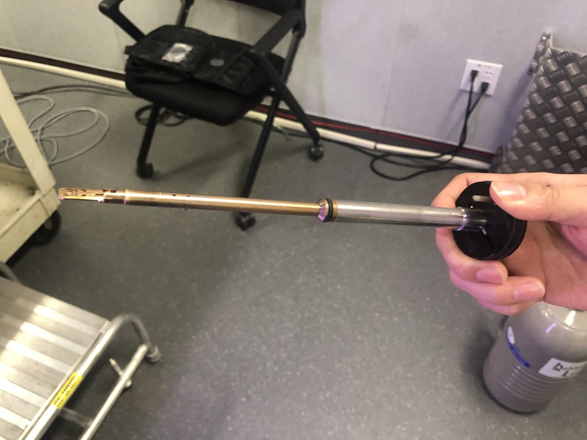
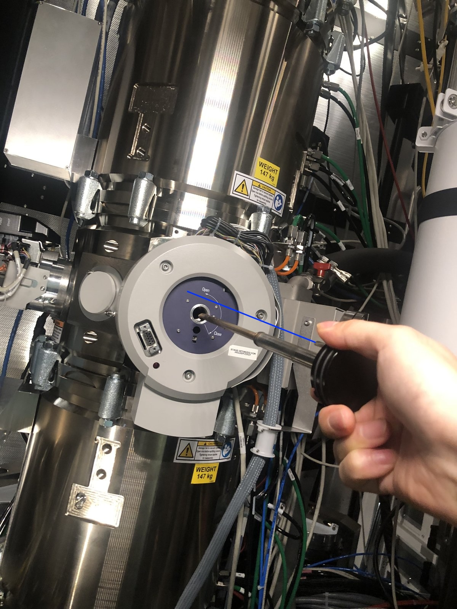
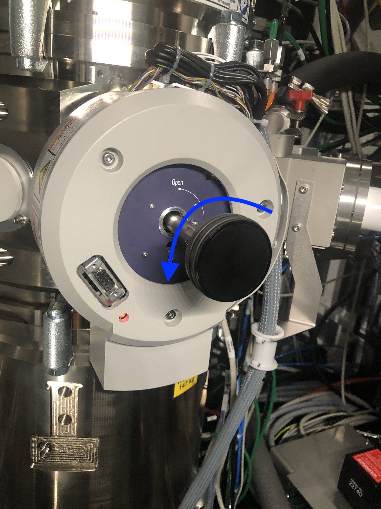
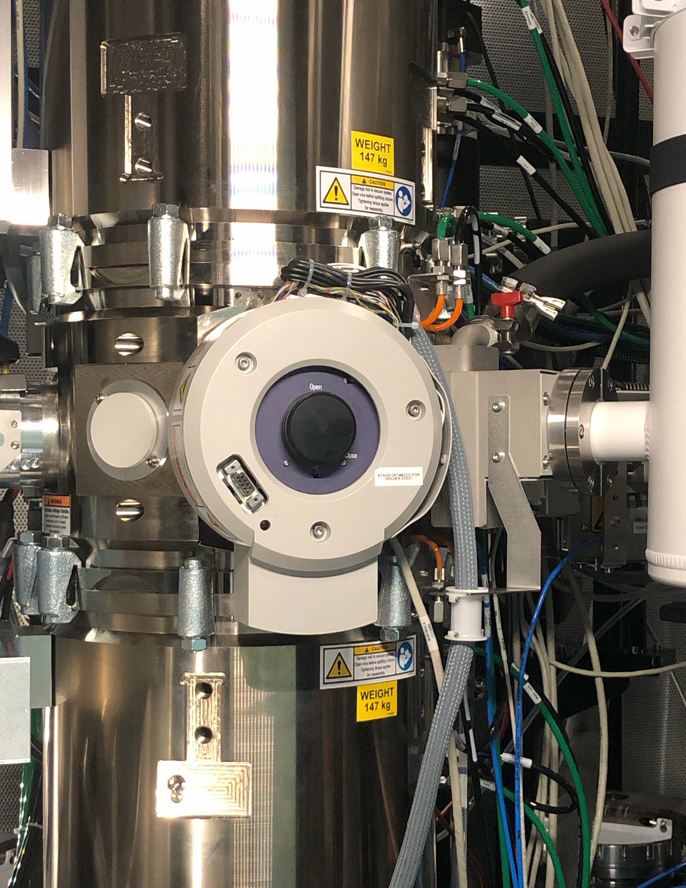

# Sample Loading

> Disclaimer: This guide is written for those who have already used single-tilt and double-tilt, tomography holders. If you are using this documentation for the first time, you should work with a supervisor.

> ⚠️ **Always wear gloves.** Do not touch any part of the holder that gets inserted into the microscope, including the metal rod.

## Location

**TITAN:**

Sample loading is done outside of the room where Titan is hosted:

**Spectra 300:**

Sample loading can be done inside the Spectra room:

Sample holders are stored here at room temperature:

## Single-tilt holder

**Load sample:**

> FIXME: use technical terms for these objects... "pin" or "clip"?

1. Push the pin inside the tiny hole shown below:

   

2. Lift the clip gently:

   

3. If using a copper grid, pinch the tip of the copper grid

   

4. Place the sample, shiny side up for the standard sample

   

## Double-tilt holder

**Load sample:**

1. Load the sample and washer (gold donut):

   

2. Add the cap and rotate the holder about the long axis to ensure the sample is secure:

   

**Unload sample:**

1. Press down the very small hole gently as shown below:

   

2. The three parts should all be disassembled and placed on the bottom:

   

## Tomography holder

**Unload sample**

1. The sample grid is held between the two "arms" of the metal strips.

   

2. Rotate the screw counterclockwise about 90 degrees. Repeat for the other "arm".

   

3. Move the two strips away from each other to free the sample

   From:

   

   To:

   

4. Remove the sample

   

**Load sample**

Follow the process in reverse: load a new sample, pull the two strips closer together, and rotate the screws clockwise.

## Start session

**Holding the sample:**

1. Ensure you do not touch the metal rod as it is inserted into the instrument:

   

2. Notice the blue line below. Align accordingly.

   

3. Push the holder in until you feel resistance. Do **NOT** push all the way in.

4. The turbo pump will start automatically.

5. Wait ~2 minutes for pressure to stabilize. You can see the time in `TEMUI`, or on the screen attached to the Spectra instrument.

   

   > Why wait? The holder insertion opens a small chamber to atmosphere. The turbo pump must evacuate this air before you can insert the holder into the main column. Rushing this step would introduce air into the ultra-high vacuum column, potentially damaging the electron gun and contaminating the system.

6. Turn the holder **COUNTER-CLOCKWISE** until you feel gently stuck, then guide the holder to push in. Expect the holder to move in smoothly.

   

7. In `TEMUI`, turn off the turbo pump. Confirm the holder type as you are prompted in `TEMUI`.

## End session

> Use this section when finishing any session (STEM, EELS, EDS, 4D-STEM, etc.).

1. Set magnification to lower SA range (< 10,000×).

2. For Titan, expand the beam to larger circle fluorescent screen.

3. In `TEMUI`, press `Column Valves Closed`.

4. In `TEMUI`, press `Reset Holder`.

   

5. Pull the holder straight out to the first resistance point

6. Turn **CLOCKWISE**, then pull the rest out continuously

7. Unload the sample from the holder using the appropriate section above (single-tilt, double-tilt, or tomography).

## Changelog

- Dec 20, 2025 - Rnhance holder insersion process with visuals
- Dec 18, 2025 - Reorganize into Start/End session sections for use across all tutorials by @bobleesj
- Dec 17, 2025 - Add sample loading region by @bobleesj
- Dec 15, 2025 - Add tomography holder section by @bobleesj, with images taken by Guoliang Hu
- Dec 13, 2025 - Add single-tilt, double-tilt holder section by @bobleesj, with images taken by Guoliang Hu
